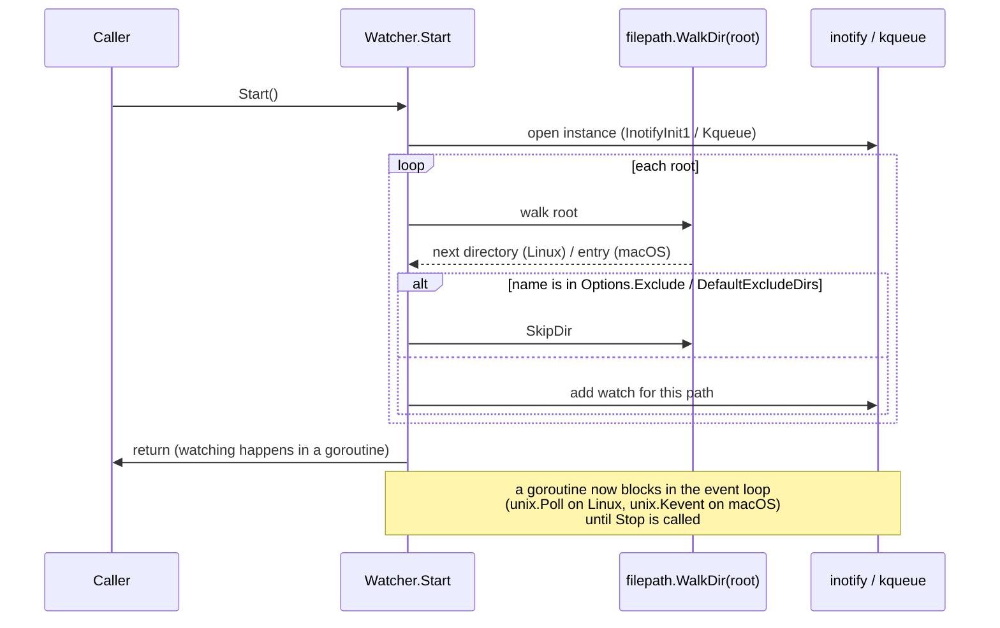
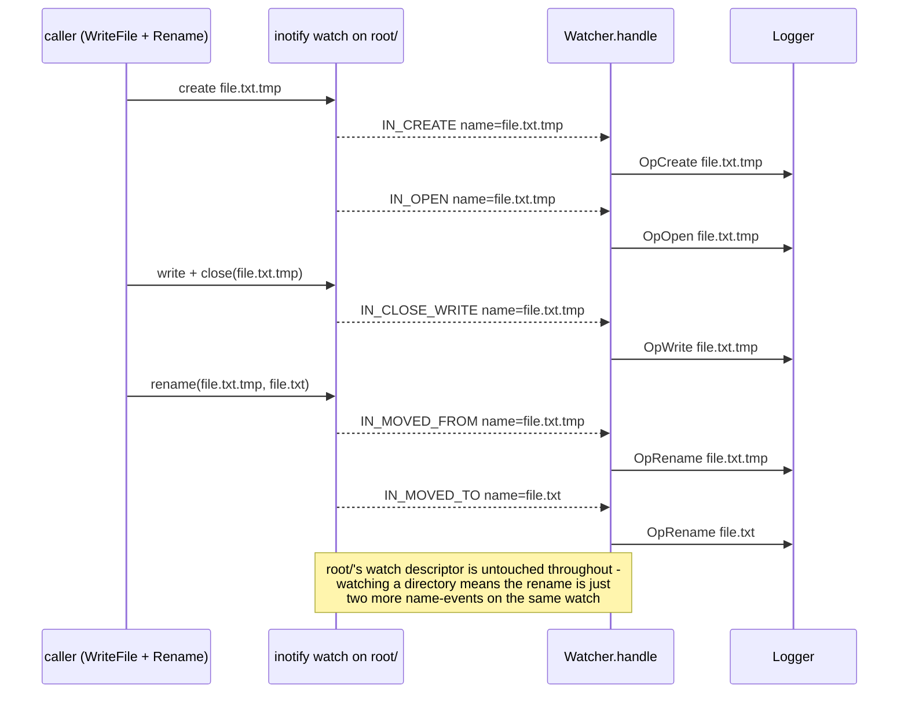
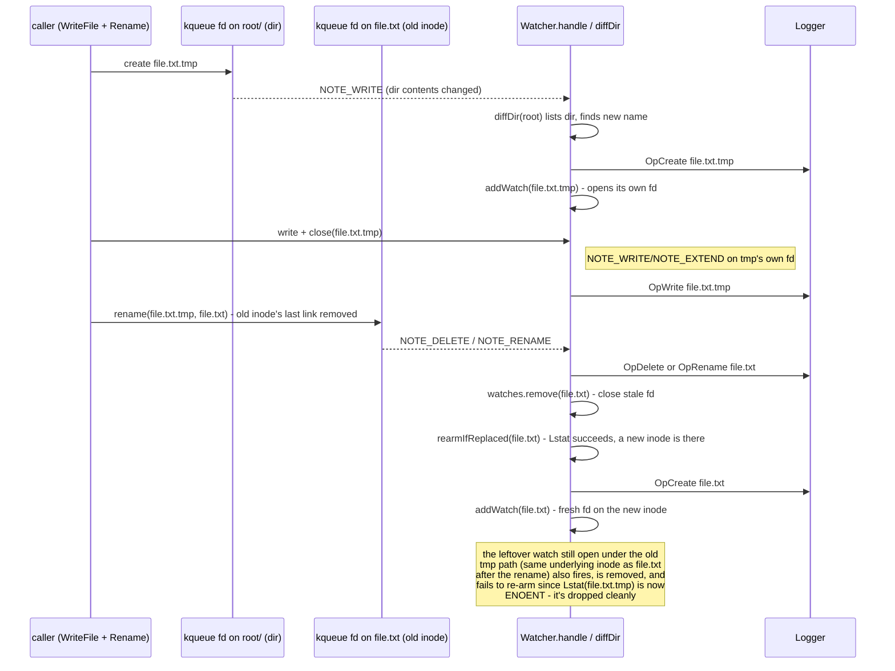

# fswatch internals

`internal/fswatch` is the host-side watcher backing `--audit` (see [02-config.md](02-config.md#runaudit-section)). It has one implementation per OS - `watcher_linux.go` (inotify), `watcher_darwin.go` (kqueue) - behind the same `Watcher`/`New`/`Start`/`Stop` API. This page exists because the two backends can't be understood from the Go alone: they're thin wrappers over kernel event models documented in `man 7 inotify` and the kqueue man page, and the interesting behavior lives in how each one reacts to events, not in the wrapper code itself. Read this alongside the source, not instead of it.

## Why two backends at all

Neither OS gives you "watch this whole tree." Both only watch individual filesystem objects, so `Watcher` always does its own recursion (`addTree`) and its own bookkeeping of what's currently watched (the `watchSet` type in each file). Where they diverge is _what_ they watch:

- **inotify (Linux)** watches directories. A watch on a directory reports activity on every entry inside it (create, delete, rename, open, close-write), keyed by name. Files themselves are never watched directly.
- **kqueue (macOS)** watches open file descriptors, one `EVFILT_VNODE` registration per fd. There's no "watch this directory's contents" primitive - so `Watcher` opens _every_ file and directory individually, and recovers "something was added or removed" by diffing a directory's listing whenever its own fd reports `NOTE_WRITE`.

That single difference is why the two files don't share more code, and why they behave differently under the same scenario below.

## Startup: `Start` → `addTree` → per-entry watch

Both backends do the same three things, just with different syscalls:



A root that fails to watch (doesn't exist, permission denied) is logged as a `Detail` entry and skipped - only failure to initialize the OS instance itself is fatal to `Start`.

## Shutdown: `Stop`

Both backends use the same trick to get out of a blocking syscall: instead of closing the watch fd out from under the event loop (unreliable while a read/poll is in flight), `Stop` writes to a side channel the loop is also waiting on, and the loop notices that and returns on its own.

```mermaid
sequenceDiagram
    participant Caller
    participant Stop
    participant Loop as event loop goroutine
    participant OS as OS watch handle

    Caller->>Stop: Stop()
    alt Linux
        Stop->>Loop: write byte to stop pipe
        Note over Loop: unix.Poll wakes on stopR
    else macOS
        Stop->>Loop: EVFILT_USER wakeup event
        Note over Loop: unix.Kevent wakes on wakeupIdent
    end
    Loop-->>Stop: close(done)
    Stop->>Stop: wait on done (2s bound)
    Stop->>OS: close all watch fds
```

`sync.Once` makes this idempotent - a second `Stop()` call is a no-op.

## The interesting case: an atomic file replace

Editors and agentic tools commonly save by writing to a temp file, then `rename`-ing it over the real file (so a reader never observes a half-written file). This is where the two backends genuinely diverge, because it's exactly the scenario where "watch the directory" and "watch the inode" stop meaning the same thing.

### Linux (inotify) - trivial, because the watch is on the directory

The watched directory's watch descriptor never changes - the rename is just two more names crossing the same watched directory, so nothing needs to be re-armed.



### macOS (kqueue) - the old inode has to be detected, dropped, and replaced

`file.txt` was already open (its own fd, its own `EVFILT_VNODE` registration) before the rename. `rename()` atomically unlinks whatever the destination name pointed to - from that fd's point of view, its last link just vanished. The fd is still open and still valid, but it's now watching an orphaned inode that the directory no longer names. `Watcher` has to notice that, close the stale registration, and open a fresh fd on whatever now lives at that path.



This divergence is also why `OpOpen` never fires on macOS at all (kqueue's `EVFILT_VNODE` has no open/close event, only write/extend/delete/rename/attribute-change), and why a macOS `OpWrite` is coarser than Linux's `IN_CLOSE_WRITE` - it's "the file's data or size changed," not "a writable fd was closed." Both are noted at the top of `watcher_darwin.go`.

## Further reading

- `man 7 inotify` - the actual event semantics `watcher_linux.go` wraps (this page's diagrams simplify; the man page is the source of truth for edge cases like queue overflow or watch limits)
- kqueue / `EVFILT_VNODE` - no single canonical man page across all macOS versions, but `man kqueue` on a Mac is the starting point
- [`watcher_backends_test.go`](../internal/fswatch/watcher_backends_test.go) - the shared test suite both backends must pass identically; each test's `// Assert` comment doubles as a plain-English description of the guarantee being tested
