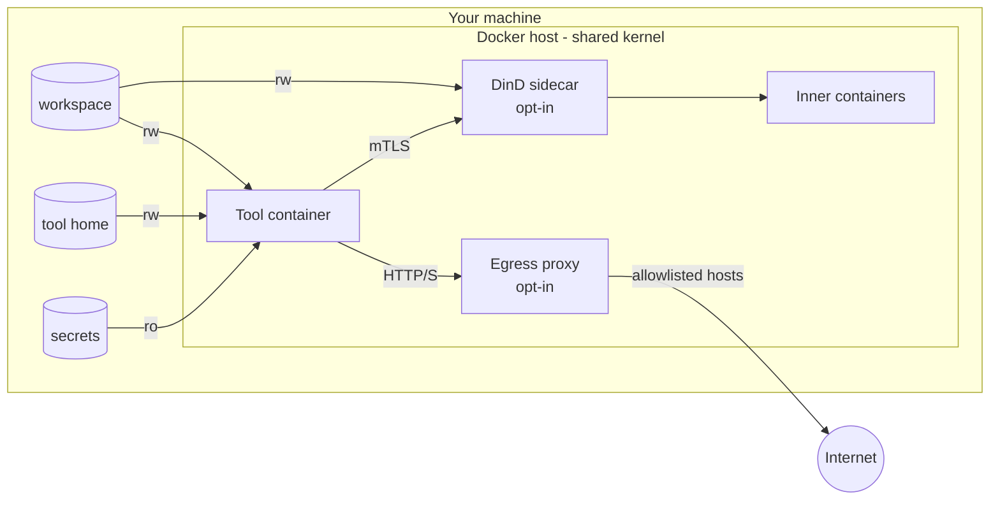

# Security model

A plain-language map of how agentic isolates a tool: each layer, what it stops, and what it doesn't. The threat is the agent itself - a bug, a bad decision, or a prompt injection in something it reads. The goal: it can only touch what you hand it.

## The map



Everything inside "Docker host" shares one Linux kernel. That's the boundary all layers below ultimately rest on.

## Layers

| Layer | What it stops | What it doesn't stop | Code |
| --- | --- | --- | --- |
| **Tool container**: read-only root, all capabilities dropped, `no-new-privileges`, your uid/gid, pid/cpu/memory limits | Changing the system, becoming root, fork bombs and runaway memory | Anything it can do with the mounts it's given; a kernel bug | `internal/docker/runargs.go` |
| **Mounts**: only `/workspace`, the tool's own home dir, and read-only secrets | Reading the rest of your files (`~/.ssh`, other repos, browser data) | Reading everything that *is* mounted, including its own credentials and secrets; editing the workspace | `internal/tools/<tool>.go`, `internal/mount` |
| **Network** `agentic-net` | Reaching other containers on your Docker host | Reaching the internet | `internal/docker/network.go` |
| **Egress proxy** (opt-in, `--proxy`): tool sits on an `--internal` network whose only way out is the proxy | Talking to hosts not on the allowlist; every attempt is logged | Sending data to an allowlisted host (filtering is by host, not content) | `internal/proxy`, `internal/docker/proxy.go` |
| **DinD sidecar** (opt-in, `--dind`): rootless dockerd in its own container, mTLS, seccomp filter, no setuid binaries, sees only `/workspace` | Access to the host's Docker socket (= root on your machine); host files outside `/workspace` | Inner containers get namespaced `SYS_ADMIN`/`NET_ADMIN`, so more kernel surface; an inner container can read the sidecar's own files (incl. its TLS key); `docker push` to an allowlisted registry | `internal/docker/dind.go`, `internal/dind` - see [Docker-in-Docker](docker-in-docker.md) |
| **Build**: tool install scripts checksum-verified against a pinned SHA256 | A tampered or swapped install script | A malicious release of the tool itself | `internal/tools` |

## Configuring the layers

An egress allowlist proxy can restrict a tool's outbound traffic to a configurable set of hosts and log every connection attempt - fail-closed, so anything not on the allowlist is blocked. Toggle it per run with `--proxy` / `--no-proxy`; use `--proxy-monitor` to log without blocking anything, useful for discovering a new tool's egress needs before writing an allowlist. See [Configuration](config.md#keys) for the `[run.proxy]` config reference and setup details.

agentic refuses any mount that would expose `$AGENTIC_HOME/agentic.json`, where it records trusted directories and approvals, so the agent can't edit it to trust or approve things itself. See [Configuration](config.md#extra_mounts-and-secrets).

`read_only_mounts` in `.agenticrc.toml` (or `--read-only-mount`) forces a specific sub-path (e.g. a credentials directory) read-only while its parent mount stays writable. See [Configuration](config.md#keys) for the `read_only_mounts` config reference.

At build time, the Claude/Copilot/OpenCode install scripts are downloaded, checksum-verified against a pinned SHA256, then executed - not piped straight into `bash`. A daily scheduled job re-checks each script against the live upstream URL and opens a PR if it has changed, so the pinned checksum stays current without pinning the tool's own version. If a build ever breaks on a stale checksum before that PR lands, `--skip-install-checksum` bypasses verification for that build.

## Rules that must never break

If one of these breaks, a layer above stops meaning anything:

- Never mount the host's Docker socket.
- Never `--privileged`, never relax the tool container's flags.
- Extra capabilities, unconfined AppArmor and no `no-new-privileges` are for the DinD sidecar only.
- The sidecar's seccomp filter is never `unconfined`.
- The sidecar only sees `/workspace`.

## Leftover risk

What no layer covers today:

- **Shared kernel**: a kernel exploit escapes every container. Only a VM boundary (Kata, gVisor, [Docker Sandboxes](comparison.md)) fixes this. Keep the host kernel patched.
- **Credentials in reach**: the agent can read its own API token and any `--secret` you mount, and use them from any allowed host.
- **Workspace tampering**: the agent can edit git hooks, `Makefile`, `package.json` scripts, etc. They run on *your* machine the next time you use them outside the container. Review diffs.
- **Exfiltration to allowed hosts**: without `--proxy` the internet is open; with it, data can still go to any allowlisted host.

## Check it yourself

Run these inside the tool container:

```bash
touch /etc/test                    # fails: Read-only file system
grep CapEff /proc/self/status      # 0000000000000000: no capabilities
grep NoNewPrivs /proc/self/status  # 1: can't gain privileges
ls ~/.ssh                          # fails: not mounted
curl -I https://example.com        # with --proxy and not allowlisted: CONNECT tunnel failed, response 403
```

## Glossary

- **Capability**: a slice of root's power (e.g. `CHOWN`, `NET_ADMIN`). Dropping all of them means even uid 0 can do little.
- **Namespace**: the kernel giving a process its own view of something (processes, network, mounts, users). Containers are mostly namespaces.
- **User namespace**: maps "root inside" to an unprivileged uid outside. Rootless Docker is built on this.
- **Rootless**: dockerd runs as your user instead of root, so its "root" is fake.
- **seccomp**: a list of syscalls a process may make; everything else is refused by the kernel.
- **AppArmor**: a kernel policy limiting which files and actions a program may use.
- **`no-new-privileges`**: blocks gaining privileges through setuid binaries or file capabilities.
- **mTLS**: both sides prove who they are with certificates, so only the tool can drive the sidecar's daemon.
